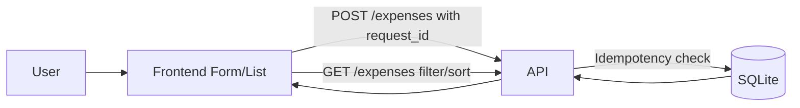

# Expense Tracker

Minimal full-stack expense tracker with production-style correctness under retries, refreshes, and duplicate clicks.

## Stack

- Backend: Node.js + Express
- Frontend: Plain HTML/CSS/JavaScript
- Database: SQLite locally, optional Postgres in serverless environments via `DATABASE_URL`
- Tests: Node test runner + Supertest

## Project Structure

- backend: API, DB access, migrations, tests, demo scripts
- frontend: static UI served by backend

## Run Locally

1. Install dependencies:

```bash
cd backend
npm install
```

2. Start server:

```bash
npm start
```

3. Open:

- http://localhost:4000 for UI
- http://localhost:4000/expenses for API

SQLite DB file is created at backend/data/expenses.db.

## Run Tests

```bash
cd backend
npm test
```

## Idempotency Demo (Proof)

Run the duplicate-submit demo:

```bash
cd backend
npm run demo:idempotency
```

What it does:

- Sends the same POST /expenses payload 5 times with same request_id
- Verifies only one expense is stored

Expected output includes:

- Scenario: User clicks submit 5 times with same request_id
- Result: Only 1 expense is created

## API

### POST /expenses

Creates a new expense.

Body:

```json
{
	"request_id": "client-generated-unique-id",
	"amount": "123.45",
	"category": "Food",
	"description": "Lunch",
	"date": "2026-04-27"
}
```

Validation:

- amount required, positive, max 2 decimals
- category required
- description required
- date required in YYYY-MM-DD
- request_id required (or Idempotency-Key header)

Idempotency behavior:

- First request with new request_id inserts row and returns 201
- Retry with same request_id returns existing row and 200
- Duplicate creation is blocked by DB unique constraint on request_id
- Insert path uses SQLite ON CONFLICT(request_id) DO NOTHING, then fetches existing row

### GET /expenses

Returns expenses list.

Optional query params:

- category: case-insensitive category filter
- sort=date_desc: newest-first sorting

Example:

GET /expenses?category=Food&sort=date_desc

## Reliability Under Failure

- Duplicate clicks: frontend disables submit while request is in-flight
- Retries/page refresh: frontend persists pending request_id in localStorage
- Partial failure: if request likely succeeded but client missed response, resubmitting same request_id returns same server record
- Slow/failed API: UI shows loading and error states, plus Retry Last Submit button
- DB enforces uniqueness so correctness does not depend only on frontend behavior

## Money Handling

- Stored in DB as integer paise (amount_paise), not float
- Reason: avoids floating point precision errors in financial values
- API returns decimal string amount for display

## Architecture



## Key Decisions

- Chose Express plus plain JavaScript to keep the feature set small and maintainable
- Stored money as integer paise to avoid floating point errors
- Enforced idempotency in the persistence layer so retries and duplicate clicks stay safe
- Kept SQLite for easy local development and added configurable deployment paths for platforms with different storage models

## Trade-offs / Intentionally Left Out

- No authentication or multi-user model
- No pagination or search (small assignment scope)
- No complex UI framework; prioritized reliability and clarity
- SQLite on Render requires a persistent disk and a single running instance

## Deployment

### Live URLs

- Frontend: https://frontend-seven-mu-65.vercel.app
- Backend/API: https://fenmo-henna.vercel.app

### Backend on Render

This repo includes [render.yaml](/C:/Users/salav/OneDrive/Desktop/fenmo/fenmo/render.yaml) for a Node web service using the `backend` directory as the service root.

The currently live backend URL above is deployed on Vercel from this environment. The `render.yaml` and backend environment support were added so you can move the API to Render cleanly for a submission flow that prefers Render.

Exact Render settings:

- Service type: `Web Service`
- Runtime: `Node`
- Root directory: `backend`
- Build command: `npm install`
- Start command: `npm start`
- Health check path: `/health`
- Environment variables:
  `FRONTEND_ORIGIN`: your deployed frontend origin, such as `https://your-frontend.vercel.app`
  `CORS_ALLOWED_ORIGINS`: comma-separated list if you want more than one allowed frontend
  `DATABASE_URL`: optional Postgres connection string if you choose managed Postgres instead of SQLite
  `SQLITE_DB_PATH`: `/var/data/expenses.db` when using Render persistent disk with SQLite

SQLite persistence on Render:

- Render’s filesystem is ephemeral unless you attach a persistent disk.
- The included `render.yaml` mounts a disk at `/var/data` and points SQLite to `/var/data/expenses.db`.
- Persistent disks are single-instance storage, so horizontal scaling is not a good fit for this SQLite setup.

### Frontend on Vercel

This repo includes [frontend/package.json](/C:/Users/salav/OneDrive/Desktop/fenmo/fenmo/frontend/package.json) and [frontend/vercel.json](/C:/Users/salav/OneDrive/Desktop/fenmo/fenmo/frontend/vercel.json) for a standalone static deployment.

Exact Vercel settings:

- Root directory: `frontend`
- Framework preset: `Other`
- Install command: `npm install`
- Build command: `npm run build`
- Output directory: `dist`
- Environment variable:
  `FRONTEND_API_BASE_URL`: your deployed backend base URL, such as `https://your-backend.onrender.com`

### Environment files

- Backend example: [backend/.env.example](/C:/Users/salav/OneDrive/Desktop/fenmo/fenmo/backend/.env.example)
- Frontend example: [frontend/.env.example](/C:/Users/salav/OneDrive/Desktop/fenmo/fenmo/frontend/.env.example)

### Verification Checklist

- Can add an expense from the deployed frontend
- Refreshing the page keeps the app usable and the list reloads
- Filtering by category works
- Sorting by newest first works
- Total reflects the currently visible list
- Duplicate submissions with the same request id do not create multiple rows
- Frontend shows an error message when the API is unavailable
