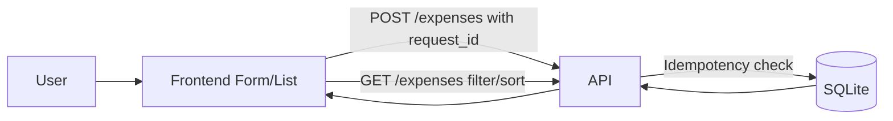

# Expense Tracker

Minimal full-stack expense tracker with production-style correctness under retries, refreshes, and duplicate clicks.

## Stack

- Backend: Express + SQLite
- Frontend: Plain HTML/CSS/JavaScript
- Tests: Node test runner + Supertest

## Project Structure

- backend: API, DB access, migrations, tests, demo scripts
- frontend: static UI served by backend

## Run Locally

1. Install dependencies:

```bash
cd backend
npm install
```

2. Start server:

```bash
npm start
```

3. Open:

- http://localhost:4000 for UI
- http://localhost:4000/expenses for API

SQLite DB file is created at backend/data/expenses.db.

## Run Tests

```bash
cd backend
npm test
```

## Idempotency Demo (Proof)

Run the duplicate-submit demo:

```bash
cd backend
npm run demo:idempotency
```

What it does:

- Sends the same POST /expenses payload 5 times with same request_id
- Verifies only one expense is stored

Expected output includes:

- Scenario: User clicks submit 5 times with same request_id
- Result: Only 1 expense is created

## API

### POST /expenses

Creates a new expense.

Body:

```json
{
	"request_id": "client-generated-unique-id",
	"amount": "123.45",
	"category": "Food",
	"description": "Lunch",
	"date": "2026-04-27"
}
```

Validation:

- amount required, positive, max 2 decimals
- category required
- description required
- date required in YYYY-MM-DD
- request_id required (or Idempotency-Key header)

Idempotency behavior:

- First request with new request_id inserts row and returns 201
- Retry with same request_id returns existing row and 200
- Duplicate creation is blocked by DB unique constraint on request_id
- Insert path uses SQLite ON CONFLICT(request_id) DO NOTHING, then fetches existing row

### GET /expenses

Returns expenses list.

Optional query params:

- category: case-insensitive category filter
- sort=date_desc: newest-first sorting

Example:

GET /expenses?category=Food&sort=date_desc

## Reliability Under Failure

- Duplicate clicks: frontend disables submit while request is in-flight
- Retries/page refresh: frontend persists pending request_id in localStorage
- Partial failure: if request likely succeeded but client missed response, resubmitting same request_id returns same server record
- Slow/failed API: UI shows loading and error states, plus Retry Last Submit button
- DB enforces uniqueness so correctness does not depend only on frontend behavior

## Money Handling

- Stored in DB as integer paise (amount_paise), not float
- Reason: avoids floating point precision errors in financial values
- API returns decimal string amount for display

## Architecture



## Key Decisions

- Chose SQLite for simple, durable local persistence without operational overhead
- Enforced idempotency in database schema and backend logic, not only in UI
- Kept frontend intentionally simple and correctness-focused

## Trade-offs / Intentionally Left Out

- No authentication or multi-user model
- No pagination or search (small assignment scope)
- No complex UI framework; prioritized reliability and clarity
- Live deployment link is not included in this repository and must be added at submission time after deployment
